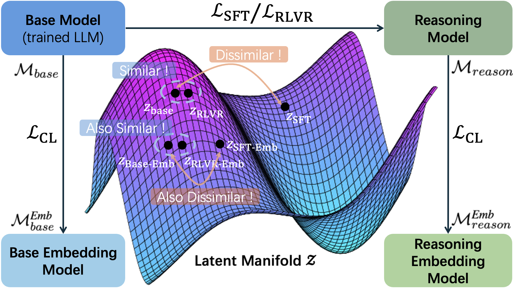

<div align="center">

# Do Reasoning Models Enhance Embedding Models? 
## (Training Codes Repository)

<p align="center">🏆  <a href="https://arxiv.org/abs/2601.21192">Arxiv Paper</a>&nbsp&nbsp | &nbsp&nbsp🤗 <a href="https://huggingface.co/collections/lucaswychan/reasoning-embedding">Hugging Face</a></p> 




</div>

This repository is the training code for the embedding model used in the paper 'Do Reasoning Models Enhance Embedding Models'. We greatly thanks the work from [Generative Representational Instruction Tuning](https://arxiv.org/abs/2402.09906). In the original GritLM implementation, they consider both embedding and generative training setting. In our work, however, we discard all generative settings as it is not necessary to train the embedding models.

## Abstract

State-of-the-art text embedding models are increasingly derived from decoder-only Large Language Model (LLM) backbones adapted via contrastive learning. Given the emergence of reasoning models trained via Reinforcement Learning with Verifiable Reward (RLVR), a critical question is whether enhanced reasoning capabilities translate to superior semantic representations. Contrary to expectation, our evaluation on MTEB and BRIGHT reveals a **null effect**: embedding models initialized from RLVR-tuned backbones yield no consistent performance advantage over their base counterparts when subjected to identical training recipes. To explain this paradox, we introduce **H**ierarchical **R**epresentation **S**imilarity **A**nalysis (HRSA), a framework that decomposes similarity across representation, geometry, and function levels. HRSA reveals that while RLVR reorganizes local geometry and induces coordinate basis drift during prolonged training, it largely preserves the latent manifold’s global geometry and linear readout directions. Consequently, subsequent contrastive learning drives strong alignment between base- and reasoning-initialized models, a phenomenon we term **Manifold Realignment**. Our findings suggest that, unlike Supervised Fine-Tuning (SFT), RLVR primarily optimizes trajectories within an existing semantic landscape rather than fundamentally restructuring the landscape itself.

## Installation

We use `uv` to manage the dependencies. FlashAttention should be separately built as using `uv sync` to build is troublesome.  
[Install `uv`](https://docs.astral.sh/uv/getting-started/installation/)

```bash
uv venv .venv --python 3.12
source .venv/bin/activate
uv pip install -r requirements.txt
uv pip install flash-attn --no-build-isolation
```

If you want to use GradCache, you need to use the one in this repository
```bash 
cd gritlm/training/GradCache
uv pip install -e .
cd ../..
```

## Embedding Model Training

To train the model, simply run

```bash
# under train/gritlm-re
bash scripts/training/train_embonly.sh
```

### Citation

Please cite our paper 😊
```bibtex
@misc{chan2026reasoningmodelsenhanceembedding,
      title={Do Reasoning Models Enhance Embedding Models?}, 
      author={Wun Yu Chan and Shaojin Chen and Huihao Jing and Kwun Hang Lau and Elton Chun-Chai Li and Zihao Wang and Haoran Li and Yangqiu Song},
      year={2026},
      eprint={2601.21192},
      archivePrefix={arXiv},
      primaryClass={cs.AI},
      url={https://arxiv.org/abs/2601.21192}, 
}
```

And also cite the original paper of GritLM 😊
```bibtex
@misc{muennighoff2024generative,
      title={Generative Representational Instruction Tuning}, 
      author={Niklas Muennighoff and Hongjin Su and Liang Wang and Nan Yang and Furu Wei and Tao Yu and Amanpreet Singh and Douwe Kiela},
      year={2024},
      eprint={2402.09906},
      archivePrefix={arXiv},
      primaryClass={cs.CL}
}
```
